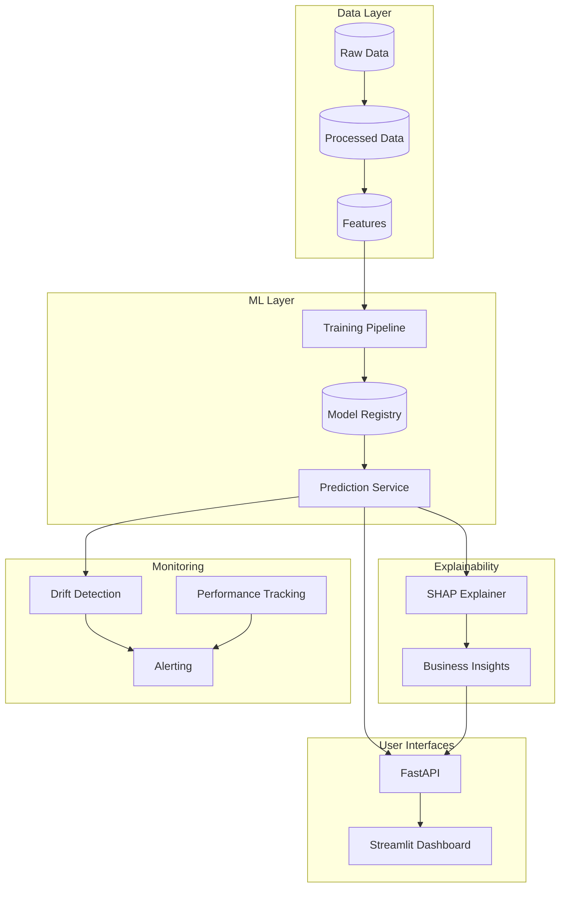
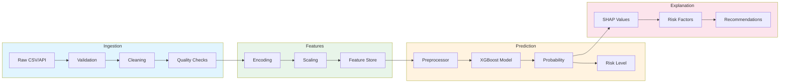
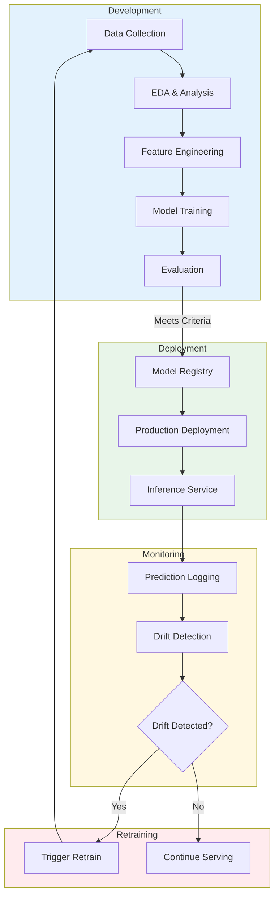
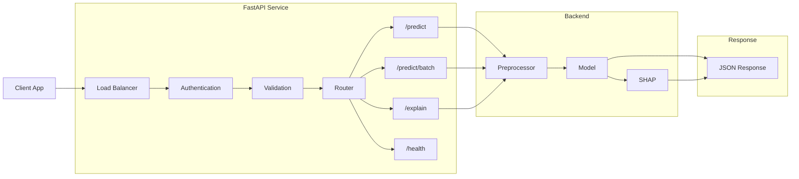
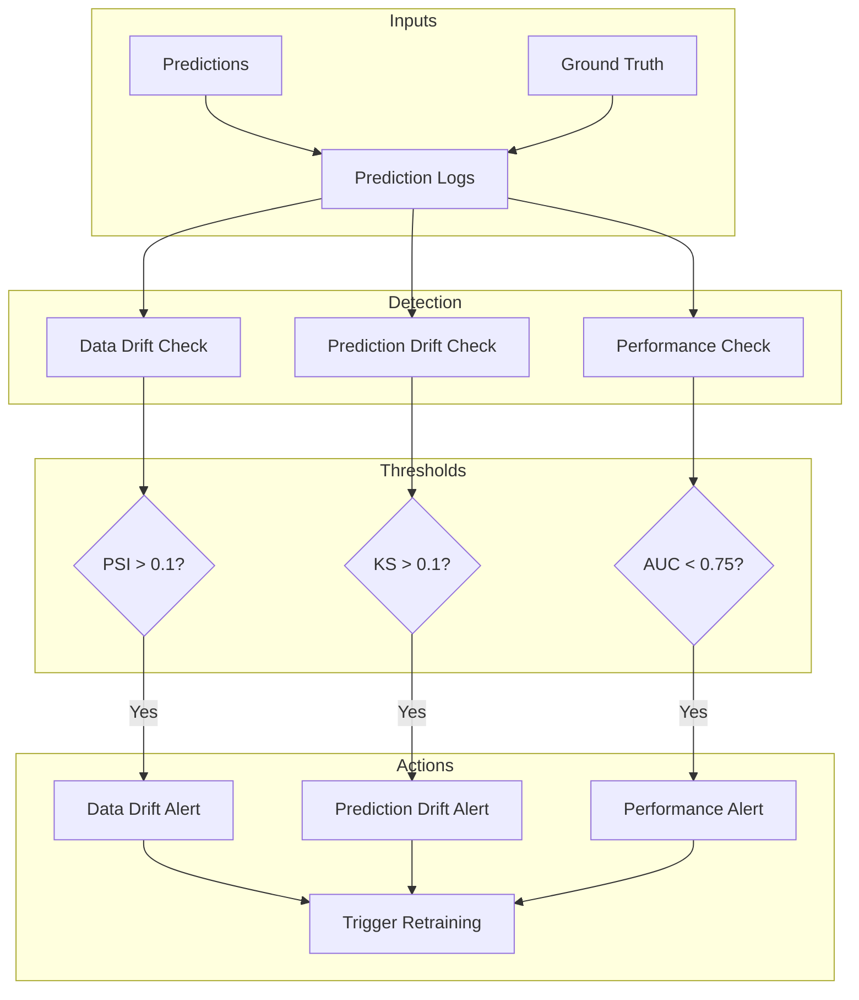
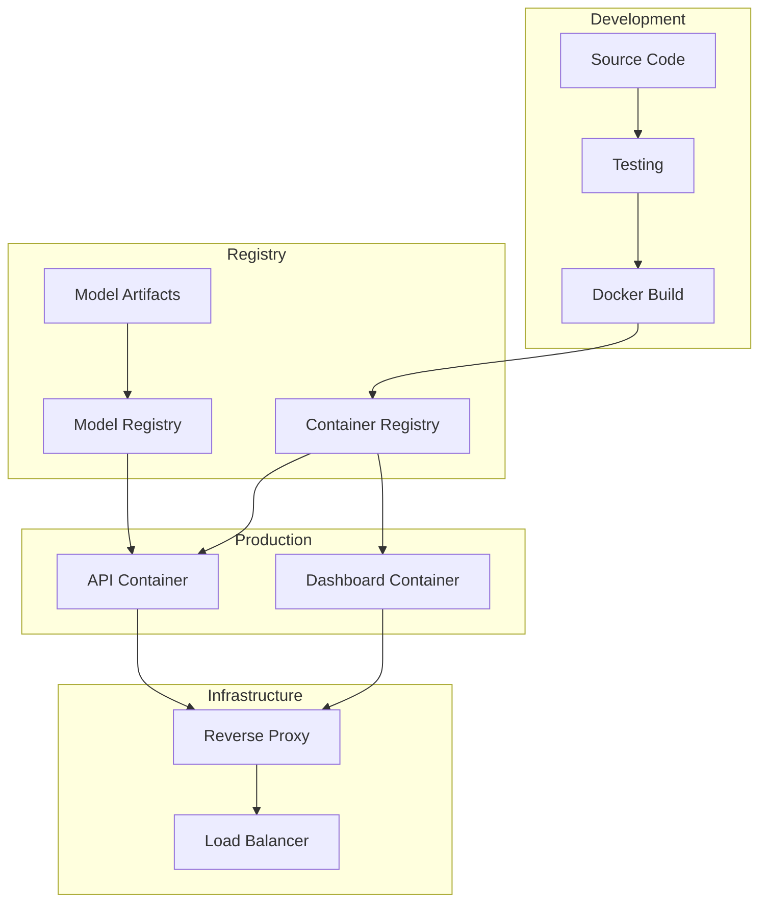

# System Architecture

This document describes the architecture of the Customer Churn Intelligence Platform, including system design, data flow, and component interactions.

---

## High-Level System Design



---

## Component Overview

| Component | Technology | Responsibility |
|-----------|------------|----------------|
| **Data Ingestion** | Python, Pandas | Load, validate, clean raw data |
| **Feature Engineering** | Scikit-learn | Transform features for ML models |
| **Model Training** | XGBoost, MLflow | Train and version models |
| **Prediction Service** | FastAPI | Real-time and batch inference |
| **Explainability** | SHAP | Generate prediction explanations |
| **Monitoring** | Custom | Track drift and performance |
| **Dashboard** | Streamlit | Interactive visualizations |

---

## Data Flow Pipeline



### Data Flow Stages

1. **Ingestion**: Raw data loaded, validated against Pydantic schemas, cleaned
2. **Features**: Categorical encoding (OneHot), numerical scaling (Standard)
3. **Prediction**: Model inference with probability calibration
4. **Explanation**: SHAP values converted to business insights

---

## Model Lifecycle



### Lifecycle Stages

| Stage | Description |
|-------|-------------|
| **Development** | Data analysis, feature creation, model training |
| **Deployment** | Validated models pushed to registry and production |
| **Monitoring** | Continuous drift and performance tracking |
| **Retraining** | Automatic trigger when drift exceeds thresholds |

---

## API Architecture



### Endpoints

| Endpoint | Method | Description |
|----------|--------|-------------|
| `/health` | GET | Service health and model status |
| `/predict` | POST | Single customer prediction |
| `/predict/batch` | POST | Batch predictions (up to 1000) |
| `/explain` | POST | SHAP-based explanation |
| `/docs` | GET | Swagger UI |

---

## Monitoring Architecture



### Monitoring Metrics

| Metric | Threshold | Action |
|--------|-----------|--------|
| PSI (Population Stability Index) | > 0.1 | Data drift alert |
| KS Statistic | > 0.1 | Prediction drift alert |
| AUC-ROC | < 0.75 | Performance degradation alert |
| Calibration Error | > 0.1 | Probability reliability alert |

---

## Deployment Architecture



---

## File Structure

```
churn_predictor/
├── src/
│   ├── api/
│   │   ├── main.py           # FastAPI application
│   │   └── schemas.py        # Pydantic models
│   ├── data/
│   │   ├── ingestion.py      # Data loading
│   │   ├── preprocessing.py  # Data cleaning
│   │   └── validation.py     # Schema validation
│   ├── models/
│   │   ├── feature_engineering.py
│   │   ├── train_pipeline.py
│   │   └── evaluation.py
│   ├── explainability/
│   │   ├── shap_explainer.py
│   │   └── business_insights.py
│   └── monitoring/
│       └── monitoring_service.py
├── dashboard/
│   ├── app.py                # Main Streamlit app
│   └── pages/                # Dashboard pages
├── models/                   # Saved model artifacts
├── tests/                    # Test suite
└── docs/                     # Documentation
```
