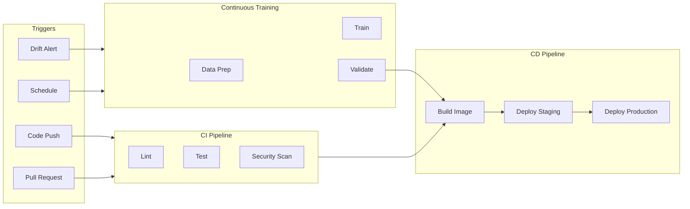

# CI/CD Architecture

Complete automation documentation for the Customer Churn Intelligence Platform.

---

## Pipeline Overview



---

## Workflows

| Workflow | Trigger | Purpose |
|----------|---------|---------|
| `ci.yml` | Push, PR | Lint, test, coverage |
| `model-validation.yml` | Model changes | Validate before promotion |
| `continuous-training.yml` | Schedule, drift | Retrain models |
| `cd.yml` | CI success | Deploy to staging/production |
| `drift-detection.yml` | Daily schedule | Monitor drift |

---

## CI Pipeline (`ci.yml`)

### Stages
1. **Lint** - Black, flake8, isort, mypy
2. **Unit Tests** - 80% coverage required
3. **Integration Tests** - API and pipeline tests
4. **Security Scan** - Bandit, safety
5. **Quality Gate** - All checks must pass

### Triggers
- Push to `main` or `develop`
- Pull requests to `main` or `develop`

### Artifacts
- Test reports (JUnit XML)
- Coverage reports (HTML, XML)

---

## Model Validation (`model-validation.yml`)

### Gates
| Metric | Threshold | Action if Failed |
|--------|-----------|------------------|
| AUC-ROC | ≥ 0.80 | Reject model |
| Precision@20% | ≥ 0.65 | Reject model |
| Calibration Error | ≤ 0.10 | Reject model |

### Process
1. Load candidate model
2. Evaluate on benchmark data
3. Compare with production model
4. Log results to MLflow
5. Approve or reject

---

## Continuous Training (`continuous-training.yml`)

### Triggers
| Trigger | Condition |
|---------|-----------|
| Schedule | Weekly (Sunday 2 AM UTC) |
| Drift | PSI > 0.1 or KS > 0.1 |
| Manual | Workflow dispatch |
| Data | New data in `data/` |

### Steps
1. Check if retraining needed
2. Prepare and version data
3. Train new model
4. Validate model
5. Register if passed
6. Trigger deployment

---

## Continuous Deployment (`cd.yml`)

### Environments
| Environment | Trigger | Approval |
|-------------|---------|----------|
| Staging | Auto on CI success | None |
| Production | Manual or main merge | Required |

### Blue/Green Strategy
1. Deploy to green (inactive)
2. Health check green
3. Switch traffic to green
4. Monitor for 10 minutes
5. Rollback if issues

### Rollback
- Automatic on health check failure
- Manual via workflow dispatch
- Previous version always available

---

## Drift Detection (`drift-detection.yml`)

### Schedule
Daily at 6 AM UTC

### Metrics
| Metric | Threshold | Action |
|--------|-----------|--------|
| PSI (data) | > 0.1 | Trigger retraining |
| KS (predictions) | > 0.1 | Trigger retraining |

### Flow
```
Check Data Drift → Check Model Drift → Trigger Retraining (if needed)
```

---

## Secrets Management

### Required Secrets
| Secret | Purpose |
|--------|---------|
| `GITHUB_TOKEN` | Registry access (auto) |
| `MLFLOW_TRACKING_URI` | Experiment tracking |
| `DOCKERHUB_TOKEN` | Container registry (optional) |
| `SLACK_WEBHOOK` | Notifications (optional) |

### Configuration
- Environment secrets in GitHub Settings
- Never commit secrets to code
- Use environment-specific configs

---

## Environment Configuration

### Staging
```yaml
API_URL: https://staging-api.example.com
MODEL_VERSION: latest
LOG_LEVEL: DEBUG
```

### Production
```yaml
API_URL: https://api.example.com
MODEL_VERSION: <approved-version>
LOG_LEVEL: INFO
```

---

## Audit Trail

Every deployment records:
- Version deployed
- Deployer (GitHub actor)
- Timestamp
- Model version
- Data version used for training

Access via:
- GitHub Actions logs
- MLflow experiment tracking
- Deployment history in releases

---

## Troubleshooting

### CI Failures
| Issue | Solution |
|-------|----------|
| Lint errors | Run `black src/ tests/` locally |
| Test failures | Check test output in artifacts |
| Coverage low | Add tests for uncovered code |

### Deployment Failures
| Issue | Solution |
|-------|----------|
| Health check failed | Check API logs in container |
| Image build failed | Verify Dockerfile locally |
| Rollback needed | Use manual workflow dispatch |

### Retraining Failures
| Issue | Solution |
|-------|----------|
| Data not found | Check data download step |
| Validation failed | Review model metrics |
| Registry error | Check MLflow connection |

---

## Quick Commands

```bash
# Run CI locally
black src/ tests/
flake8 src/ tests/
pytest tests/ --cov=src

# Build Docker image
docker build -t churn-predictor:local .

# Run container
docker run -p 8000:8000 churn-predictor:local

# Trigger workflow manually
gh workflow run ci.yml
gh workflow run continuous-training.yml -f reason=manual
```
